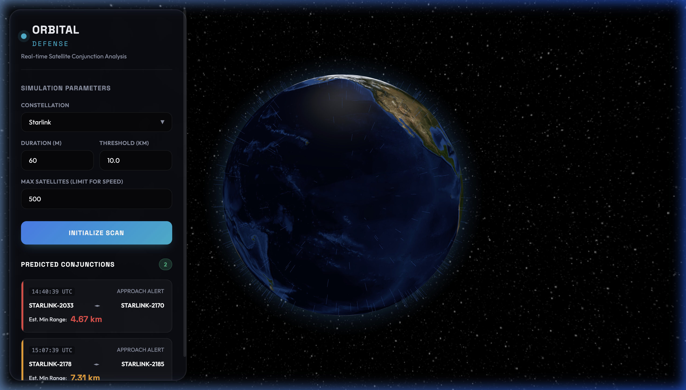

# Satellite Collision Detection System

## Preview


## Overview
A real-time Python & HTML/CSS/JS tracking dashboard that utilizes Celestrak TLE data and the `skyfield` SGP4 propagation library to calculate and predict near-earth satellite conjunctions (close approaches).

The project features a lightweight Flask backend APIs and a stunning dark-theme glassmorphic frontend built with `Globe.gl` to visualize the active spatial threats.

## Features
* **Real-time Live Data**: Fetches latest Object parameters from Space-Track / CelesTrak.
* **Vectorized Distance Calculations**: Solves the N-body range calculations quickly utilizing `scipy` optimized distance matrices.
* **3D Visualization**: Generates a beautiful glowing rendering of the Earth with custom plotted threat arcs between converging satellites.
* **Configurable Constraints**: Adjust duration, interval steps, and distance thresholds dynamically via the UI.

## Tech Stack
* **Backend**: Python 3.9, Flask, SGP4 (via Skyfield), NumPy, Pandas, SciPy, Requests.
* **Frontend**: Vanilla Javascript, Vanilla CSS, HTML5, Globe.gl, Three.js.

## Installation & Setup

1. **Clone the repository**
```bash
git clone https://github.com/YOUR_USERNAME/Satellite_Collision_Detection.git
cd Satellite_Collision_Detection
```

2. **Create a Python Virtual Environment**
```bash
python3 -m venv venv
source venv/bin/activate  # On Windows: venv\\Scripts\\activate
```

3. **Install Dependencies**
```bash
pip install -r requirements.txt
```

4. **Launch the Server**
```bash
python3 app.py
```

5. **Open Dashboard**
Navigate to `http://127.0.0.1:5000` in your web browser.

## Project Structure
- `app.py`: Flask REST API serving prediction endpoints.
- `data_fetcher.py`: TLE ingestion engine.
- `propagator.py`: Time-series mathematical generation of GCRS geocentric coordinates.
- `detector.py`: Scipy pair-wise collision detection and index management.
- `main.py`: Command line fallback generator.
- `/frontend/`: Contains the static `index.html`, `app.js`, and `index.css` files.
- `/data/`: Autogenerated folder where raw TLE text files are stored.

## Future Roadmap (Ideas)
- Add full database system for tracking long-term orbital decay.
- Email/SMS integrations for specific object alerts (e.g. tracking ISS).
- Implement WebSockets for true live-streaming of position updates without manual scans.

## License
MIT License.
